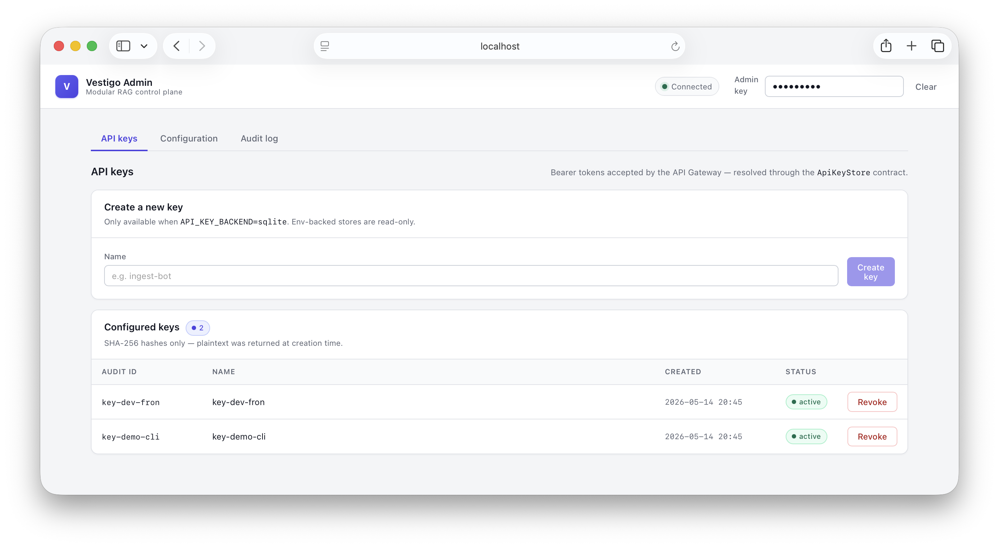
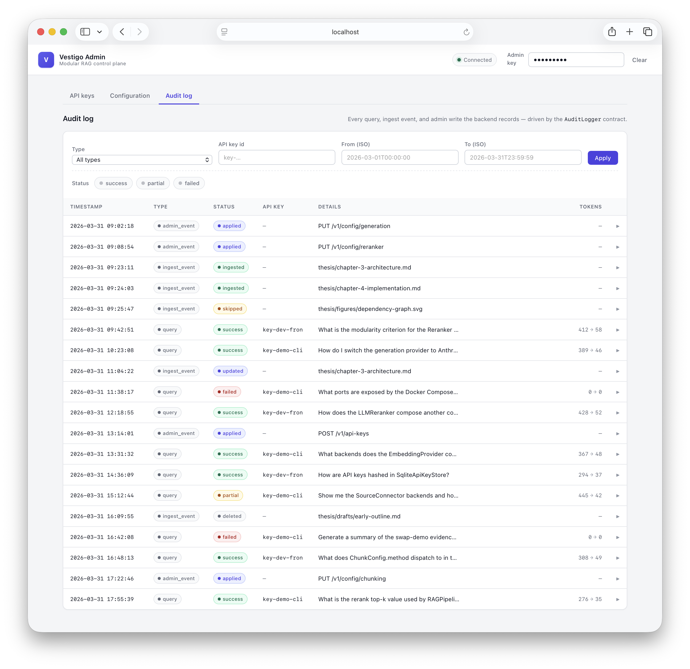

# vestigo-rag-stack

> **Modular, fully self-hostable RAG (Retrieval-Augmented Generation) service architecture with independent, swappable components behind a standardized API.**

Developed as a working prototype for a [TalTech (Tallinn University of Technology)](https://taltech.ee) bachelor's thesis, demonstrating the architectural feasibility of modular, self-hosted RAG services.

---

## Overview

vestigo-rag-stack is a fully on-premise, modular RAG service architecture. Solutions like OpenWebUI offer integrated RAG capabilities, but bundle them into a monolithic package. vestigo-rag-stack takes a different approach — separating each RAG concern into an independent, swappable service for organizations that need fine-grained control, component-level replaceability, and architectural transparency. It is suitable for any environment where data sovereignty and self-hosting are priorities: every component runs on-premise with no external SaaS dependencies, all data stays within the organization's infrastructure, and each module can be audited, replaced, or configured independently. This makes it particularly relevant for public sector organizations where data privacy and regulatory compliance are critical requirements.

The core design principle: **RAG functionality is separated from the UI into independent, swappable services behind a standardized API.** Each component — ingestion, retrieval, generation, storage — operates behind a formal interface contract and can be replaced independently without affecting the rest of the system.

The system exposes an **OpenAI Responses API-compatible endpoint**, enabling any compatible frontend (OpenWebUI, custom UI, other clients) to use it as a drop-in backend.

---

## Documentation

| Document | Description |
|---|---|
| [Architecture](docs/architecture.md) | Core modules, communication model, and modularity guarantees |
| [Contracts](docs/contracts.md) | Internal service contract specifications for all swappable components |
| [Pipeline & Document Lifecycle](docs/pipeline.md) | RAG query orchestration flow and document change detection |
| [Requirements & Tech Stack](docs/requirements.md) | Hard constraints, validation criteria, tech stack, and project structure |
| [Swap-Demo Evidence](docs/swap-demo.md) | Per-contract swap walkthrough proving the modularity criteria |
| [Deployment Runbook](docs/deployment.md) | Docker Compose flow, first-run bootstrap, swap recipes, backup |
| [Implementation Phases](docs/phases.md) | Phased delivery plan with exit criteria |
| [Changelog](docs/changelog.md) | Specification version history |

---

## What This Project Is

- A **thesis prototype** proving architectural feasibility of modular, self-hosted RAG
- A **backend RAG service layer** with a minimal Admin UI
- A demonstration of **component replaceability** via interface contracts
- A fully **self-hostable** system with no SaaS dependencies

## What This Project Is NOT

- A production-ready enterprise system — it is a thesis prototype proving architectural feasibility
- A UI project — the focus is the backend RAG service layer (Admin UI is the exception)
- A model fine-tuning or training project — existing models are used as-is

## Expected Scale (Prototype Scope)

- Hundreds to low thousands of documents — not millions
- Single-digit concurrent users
- This justifies simpler choices (e.g., ChromaDB over a distributed vector DB) while the architecture remains designed for future scaling

---

## Quick Start

A working research prototype rather than a packaged product — both flows below have been verified to come up clean on a fresh checkout. `200 OK` from each `/health` endpoint after startup is the signal that every contract binding resolved and the modular service topology is live. The [Deployment Runbook](docs/deployment.md) covers first-run bootstrap, swap recipes, and troubleshooting.

### Docker Compose (recommended)

One command brings up the API gateway, the admin API, the ingest API, the admin web UI, and the vector store, each as a separate process on a shared Docker network:

```bash
cp .env.example .env       # set ADMIN_API_KEY / INGEST_API_KEY if you want auth
docker compose up -d       # builds images on first run, then starts everything
```

Verify:

```bash
curl http://localhost:8000/health   # API Gateway
curl http://localhost:8001/health   # Admin API
curl http://localhost:8002/health   # Ingest API
open http://localhost:3000          # Admin UI
```

The OpenAI-compatible LLM server (vLLM is the thesis-target upstream; bringing it up is out of scope for this prototype) stays on the host — the stack reaches it via `host.docker.internal`. Edit `config/config.yaml` to point `embedding.endpoint` and `generation.endpoint` at `http://host.docker.internal:8080/v1` (or whatever host:port your OpenAI-compatible server is exposing) before the first request.

See [Deployment Runbook](docs/deployment.md) for first-run bootstrap, swap recipes, volume layout, and troubleshooting.

### Development workflow

Requires Python 3.12+ and [uv](https://docs.astral.sh/uv/).

```bash
git clone https://github.com/IllimarR/vestigo-rag-stack
cd vestigo-rag-stack

cp .env.example .env   # infrastructure-level settings (ports, backend bindings)

uv sync                # install dependencies into .venv
uv run python main.py  # boots API Gateway :8000, Admin API :8001, Ingest API :8002
```

The default seed config (`config/config.yaml`) points the embedding and generation endpoints at `http://localhost:8080/v1` — the conventional vLLM dev port. Point this at whichever OpenAI-compatible server you have running (vLLM, LM Studio, llamacpp-server, LocalAI, OpenAI itself, ...).

Quick smoke test:

```bash
# dev mode — empty API_KEYS allows anonymous requests
curl -s http://localhost:8000/v1/responses \
  -H 'Content-Type: application/json' \
  -d '{"input": "hello", "stream": false}'
```

---

## Admin UI

The operator control plane runs on port 3000 (Vite + React) and talks to the Admin API at port 8001 via a typed `fetch` wrapper. Three views cover the day-to-day operator surface — API keys, configuration, and the audit log.

### API keys



Manage gateway bearer tokens. Read-only in env-backed mode; full create / revoke flow in sqlite-backed mode. SHA-256 hashes are stored; plaintext returns exactly once on create.

### Audit log



Every query, ingest event, and admin write the backend recorded — driven by the `AuditLogger` contract. Filter by type, API key, status, or time range; click any row to expand the full event payload.

### Running it

```bash
cd admin-ui
npm install
npm run dev      # http://localhost:3000
```

Set the admin bearer (`ADMIN_API_KEY` from your `.env`) in the auth bar in the UI header to unlock the views. See [admin-ui/README.md](admin-ui/README.md) for layout and scripts.

---

Refer to [Requirements & Tech Stack](docs/requirements.md) for detailed setup and configuration guidance.
